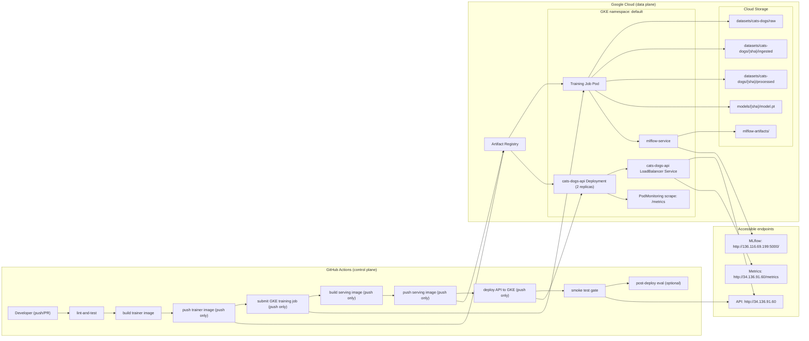

# MLOps Assignment 2: Cats vs Dogs Classification (GKE)

End-to-end MLOps pipeline for binary image classification (cats vs dogs) deployed on Google Kubernetes Engine with CI/CD, experiment tracking, data versioning, and monitoring.

## End-to-End System Design



## Project Structure

```
.
├── src/
│   ├── ingest.py              # Normalize raw Cat/Dog folders
│   ├── preprocessing.py       # Resize + train/val/test split
│   ├── train.py               # Training with parallel GCS, MLflow logging
│   ├── model.py               # CNN architectures (baseline, wider)
│   ├── main.py                # FastAPI service (/health, /predict, /metrics)
│   ├── smoke_test.py          # Post-deploy API validation
│   └── post_deploy_eval.py    # Evaluation with labeled test data
├── k8s/
│   ├── deployment.yaml        # API deployment + LoadBalancer
│   ├── production-train-job.yaml  # Full pipeline training job
│   ├── mlflow.yaml            # MLflow server deployment
│   └── monitoring/            # Prometheus PodMonitoring
├── .github/workflows/
│   └── mlops-pipeline.yml     # CI/CD pipeline
├── tests/                     # Unit and API test suite
├── dvc.yaml                   # DVC pipeline stages
├── params.yaml                # Hyperparameter config
├── Dockerfile                 # Trainer image
├── Dockerfile.serve           # Serving image (with model baked in)
└── docs/                      # Assignment requirement docs
```

## Prerequisites

- Python 3.11+ (3.12 tested)
- Docker Desktop
- (Cloud deploy) `gcloud` CLI, GKE cluster, Artifact Registry, Workload Identity setup

## Local Setup

```bash
python3 -m venv .venv
source .venv/bin/activate
pip install -r requirements.txt
```

## Local Training Pipeline

### 1. Ingest raw dataset

```bash
PYTHONPATH=. python src/ingest.py \
  --source-dir data/raw --output-dir data/ingested
```

Normalizes folder names (`Cat`/`Dog` → `cat`/`dog`) for cross-platform consistency.

### 2. Preprocess and split

```bash
PYTHONPATH=. python src/preprocessing.py \
  --input-dir data/ingested --output-dir data/processed \
  --image-size 224 --train-ratio 0.8 --val-ratio 0.1 --seed 42
```

### 3. Train model

```bash
PYTHONPATH=. python src/train.py \
  --data-dir data/processed --output-model models/model.pt \
  --artifact-dir artifacts/training --epochs 3 --batch-size 64 \
  --learning-rate 0.001 --model-variant baseline --force-cpu
```

> [!NOTE]
> Local training uses 3 epochs (as in `params.yaml`). The CI pipeline uses 1 epoch for fast iteration.

**Outputs:** `models/model.pt`, `artifacts/training/metrics.json`, confusion matrix, loss curve.

## Run API Locally

```bash
PYTHONPATH=. ENABLE_REAL_MODEL=1 MODEL_PATH=$(pwd)/models/model.pt \
  uvicorn src.main:app --host 0.0.0.0 --port 8080
```

```bash
# Health check
curl http://127.0.0.1:8080/health

# Prediction
curl -X POST http://127.0.0.1:8080/predict -F "file=@path/to/image.jpg"
```

## Service Endpoints

### API service

- External base URL: `http://34.136.91.60`
- Health: `GET /health`
- Prediction: `POST /predict`
- Metrics: `GET /metrics` (full URL: `http://34.136.91.60/metrics`)

### MLflow service

- External UI: `http://136.116.69.199:5000/`
- In-cluster endpoint used by trainer:
  - `http://mlflow-service.default.svc.cluster.local:5000`

## Experiment Tracking (MLflow)

MLflow is deployed within the GKE cluster and used for experiment tracking during training.

### What is tracked

| Category | Details |
|----------|---------|
| **Parameters** | model_variant, epochs, batch_size, learning_rate, image_size |
| **Metrics** | best_val_accuracy, test_accuracy, test_loss |
| **Artifacts** | model.pt, metrics.json, confusion_matrix.png, loss_curve.png |

### Architecture

- MLflow server runs as a GKE Deployment (`k8s/mlflow.yaml`)
- Backed by SQLite for metadata + **GCS bucket for artifacts** (`gs://<BUCKET>/mlflow-artifacts`)
- Accessible via LoadBalancer service on port 5000
- Training pod connects via in-cluster DNS (`mlflow-service.<namespace>.svc.cluster.local:5000`)

### Access MLflow UI

```bash
# Open MLflow UI
open http://136.116.69.199:5000/
```

## Data Versioning

Every pipeline run versions its data using the **commit SHA**, providing full lineage:

```
gs://<BUCKET>/
├── datasets/cats-dogs/
│   ├── raw/                          # Immutable source data
│   └── <commit-sha>/
│       ├── ingested/                 # Normalized folders
│       └── processed/               # Resized + split (train/val/test)
└── models/
    └── <commit-sha>/
        ├── model.pt                  # Trained model
        └── metrics.json              # Evaluation metrics
```

**DVC** is configured for local pipeline reproducibility:
```bash
PATH="$PWD/.venv/bin:$PATH" PYTHONPATH=. dvc repro
```

Note for this repo workflow: CI/CD deployment does not execute `dvc repro`, so `dvc.lock` is generated only when you run DVC stages manually.

## GKE Training Optimizations

| Optimization | Before | After |
|---|---|---|
| GCS Downloads | Sequential (1 thread) | **Parallel (16 threads)** |
| GCS Uploads | Sequential | **Parallel (16 threads)** |
| Node type | e2-standard-2 (2 CPU, 8 GB) | **e2-standard-4 (4 CPU, 16 GB)** |
| Training resources | No limits set | **2.5 CPU, 10 GB RAM** |
| Shared memory | 64 MB default | **1 GB emptyDir mount** |
| Auth token refresh | None (expired after 1hr) | **Every 10 minutes** |

## Docker Validation

```bash
# Build serving image
docker build -f Dockerfile.serve -t cats-dogs-api:latest .

# Run container
docker run --rm -p 8080:8080 \
  -e ENABLE_REAL_MODEL=1 -e MODEL_PATH=/app/models/model.pt \
  cats-dogs-api:latest

# Validate
curl http://127.0.0.1:8080/health
curl -X POST http://127.0.0.1:8080/predict -F "file=@sample.jpg"
```

## Tests and Lint

```bash
PYTHONPATH=. pytest -q          # Unit and API tests
flake8 src tests scripts        # Linting
```

## CI/CD Configuration

### GitHub Secrets Required

| Secret | Description |
|--------|-------------|
| `GCP_PROJECT_ID` | GCP project ID |
| `GCP_WIF_PROVIDER` | Workload Identity Federation provider |
| `GCP_SA_EMAIL` | GCP service account email |
| `GCP_BUCKET_NAME` | GCS bucket for artifacts |
| `GKE_CLUSTER_NAME` | GKE cluster name |
| `GKE_CLUSTER_LOCATION` | GKE cluster zone/region |
| `ARTIFACT_REGISTRY_REPO` | Artifact Registry repository |
| `EVAL_BATCH_GCS_URI` | (Optional) GCS path to eval batch CSV |

### Pipeline Behavior

| Trigger | Jobs Run |
|---------|----------|
| **Push to main** | Lint → Build → Train → Deploy → Smoke Test → Eval |
| **Pull Request** | Lint → Build (no push, no deploy) |

## Monitoring

- **API Logging**: Request/response middleware in FastAPI
- **Prometheus Metrics**: Counters, gauges, and histograms exposed at `/metrics`
- **GKE PodMonitoring**: `k8s/monitoring/google-pod-monitor.yaml` for metric scraping
- **Health Probes**: Liveness and readiness probes on both API and MLflow pods

### GCP Metrics Dashboard

Use Cloud Monitoring dashboards to visualize API behavior from scraped Prometheus metrics.

1. Open [Cloud Monitoring Dashboards](https://console.cloud.google.com/monitoring/dashboards?project=<PROJECT_ID>).
2. Create dashboard: `cats-dogs-mlops`.
3. Add PromQL widgets (examples):

```promql
sum(rate(cats_dogs_requests_total[5m]))
```

```promql
histogram_quantile(0.95, sum(rate(cats_dogs_request_latency_seconds_bucket[5m])) by (le))
```

```promql
histogram_quantile(0.95, sum(rate(cats_dogs_inference_latency_seconds_bucket[5m])) by (le))
```

```promql
sum(cats_dogs_in_flight_requests)
```

```promql
sum(rate(cats_dogs_prediction_errors_total[5m])) by (error_type)
```

## Post-Deployment Evaluation

```bash
# Create labeled eval batch from test split
PYTHONPATH=. python scripts/create_eval_batch.py \
  --processed-dir data/processed --output-csv artifacts/eval_batch.csv \
  --per-class 100 --seed 42

# Evaluate deployed API
PYTHONPATH=. python src/post_deploy_eval.py \
  --base-url http://34.136.91.60 --input-csv artifacts/eval_batch.csv \
  --output-json artifacts/post_deploy_eval.json
```

## Submission Packaging

```bash
./scripts/create_submission_bundle.sh
```

Output zip is created under `submission/`.

## Assignment Requirement Coverage

See [docs/ASSIGNMENT2_REQUIREMENTS_COVERAGE.md](docs/ASSIGNMENT2_REQUIREMENTS_COVERAGE.md) for the full M1–M5 requirement-to-implementation matrix.
